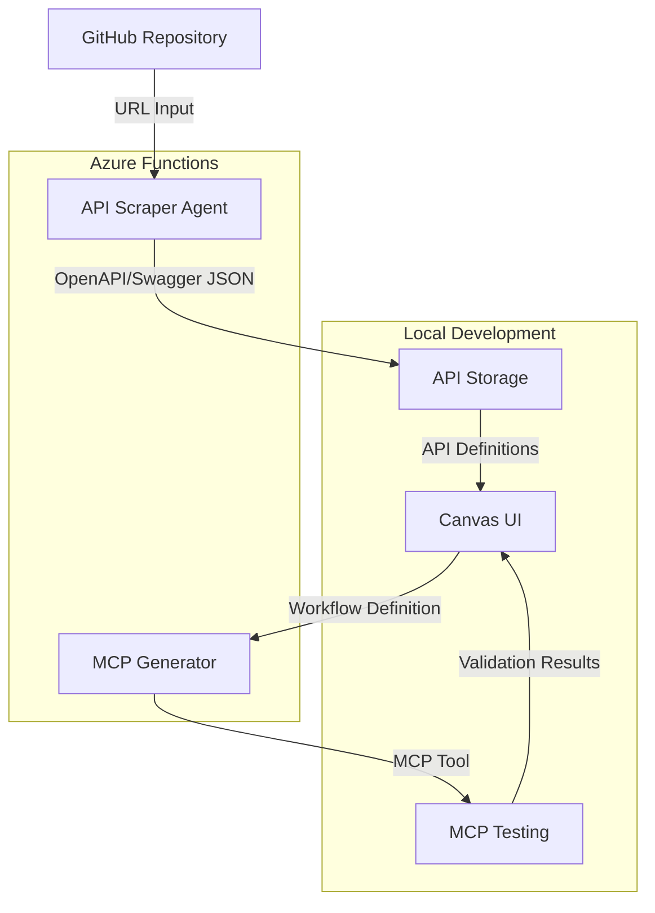
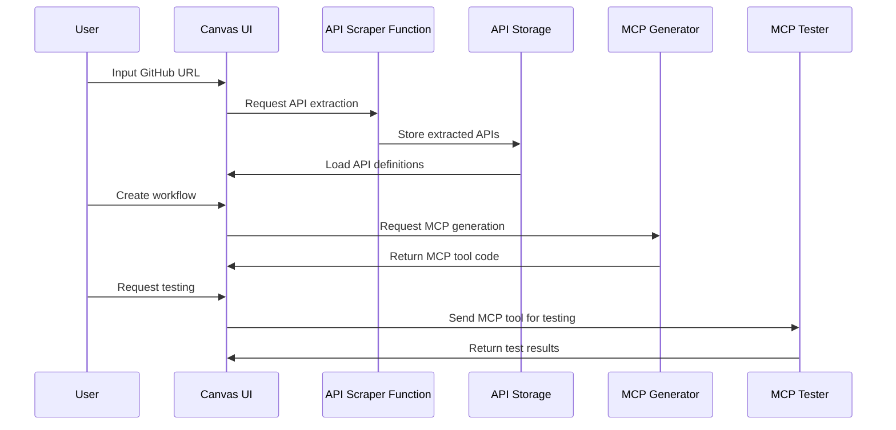

# MCP Workflow Builder - Architecture Design

Based on our discussions, I'll outline a comprehensive architecture for your API Workflow Builder POC. This design will enable you to create a system that scrapes APIs from GitHub, allows visual workflow creation, and exports these workflows as MCP tools for AI agents.

## System Overview



## Technology Stack

### Backend Components (Azure Functions)

1. **API Scraper Function**
   - **Technology**: Azure Functions (Node.js)
   - **Purpose**: Analyze GitHub repositories to extract REST API definitions
   - **Input**: GitHub repository URL
   - **Output**: OpenAPI/Swagger JSON
   - **Key Libraries**:
     - `@octokit/rest` - GitHub API client
     - `swagger-parser` - For parsing and validating OpenAPI specs
     - `openai` - Azure OpenAI SDK for intelligent API extraction

2. **MCP Generator Function**
   - **Technology**: Azure Functions (Node.js)
   - **Purpose**: Convert workflow definitions to MCP tools
   - **Input**: Workflow definition JSON
   - **Output**: MCP tool code
   - **Key Libraries**:
     - `openai` - Azure OpenAI SDK for code generation
     - `handlebars` - For templating MCP tool code

### Frontend Components (Local Development)

1. **Canvas UI**
   - **Technology**: React.js
   - **Purpose**: Provide drag-and-drop interface for API workflow creation
   - **Key Libraries**:
     - `react-flow` - For the workflow canvas
     - `material-ui` - For UI components
     - `axios` - For API communication

2. **API Storage**
   - **Technology**: Local JSON storage or SQLite
   - **Purpose**: Store extracted API definitions
   - **Schema**: Collection of OpenAPI/Swagger specifications

3. **MCP Testing Module**
   - **Technology**: Node.js
   - **Purpose**: Test generated MCP tools
   - **Key Libraries**:
     - Custom MCP runtime simulator

## Data Flow



## Component Details

### 1. API Scraper Agent

The API Scraper will be implemented as an Azure Function that:

1. Clones or downloads the specified GitHub repository
2. Analyzes the codebase to identify API endpoints
3. Uses Azure OpenAI to help interpret and structure the APIs
4. Generates OpenAPI/Swagger JSON for the identified APIs
5. Returns the structured API definitions

**Implementation Approach**:
- For repositories with existing OpenAPI/Swagger files, directly extract and parse them
- For repositories without explicit API definitions, use code analysis and AI to infer API structures
- Support common frameworks like Express.js, Flask, Spring Boot, etc.

### 2. Canvas UI

A React-based web application that provides:

1. A form to input GitHub repository URLs
2. A panel displaying extracted API endpoints
3. A canvas for dragging and connecting API endpoints
4. Basic configuration options for each endpoint and connection
5. Export functionality to generate MCP tools

**UI Mockup**:

```
+-------------------------------------------------------+
|                  MCP Workflow Builder                 |
+-------------------------------------------------------+
| GitHub URL: [                            ] [Extract]  |
+-------------------------------------------------------+
| API Endpoints:        |        Canvas                 |
| [Endpoint 1]          |                               |
| [Endpoint 2]          |    [API1] --> [API2]          |
| [Endpoint 3]          |      |                        |
| ...                   |      v                        |
|                       |    [API3]                     |
|                       |                               |
+-------------------------------------------------------+
|                [Export as MCP] [Test MCP]             |
+-------------------------------------------------------+
```

### 3. MCP Generator

An Azure Function that:

1. Receives workflow definitions from the Canvas UI
2. Analyzes the workflow structure
3. Uses templates and Azure OpenAI to generate MCP tool code
4. Returns the generated code to the Canvas UI

**MCP Tool Structure**:
- Input schema based on the first API in the workflow
- Output schema based on the last API in the workflow
- Internal logic to handle the API sequence and data mapping

### 4. MCP Testing Module

A local Node.js module that:

1. Receives the generated MCP tool code
2. Creates a temporary MCP server with the tool
3. Executes test requests against the tool
4. Validates the responses
5. Returns test results to the Canvas UI

## Implementation Plan

### Phase 1: Core Infrastructure
1. Set up Azure Function App
2. Create basic React application structure
3. Implement API storage mechanism

### Phase 2: API Scraper
1. Develop GitHub repository analyzer
2. Implement OpenAPI/Swagger extraction
3. Integrate with Azure OpenAI for intelligent extraction

### Phase 3: Canvas UI
1. Implement drag-and-drop interface
2. Create API endpoint visualization
3. Develop workflow connection mechanism

### Phase 4: MCP Generator
1. Create workflow-to-MCP conversion logic
2. Implement code generation templates
3. Integrate with Azure OpenAI for code optimization

### Phase 5: Testing and Integration
1. Develop MCP testing module
2. Integrate all components
3. Perform end-to-end testing

## Security Considerations

1. **GitHub Access**: Use token-based authentication for accessing private repositories
2. **API Credentials**: Implement secure storage for any API credentials
3. **MCP Tool Security**: Ensure generated MCP tools follow security best practices

## Scalability Considerations

1. **Large Repositories**: Implement pagination and chunking for processing large codebases
2. **Complex Workflows**: Design the canvas to handle complex API relationships
3. **Performance**: Optimize Azure Functions for cold start and execution time