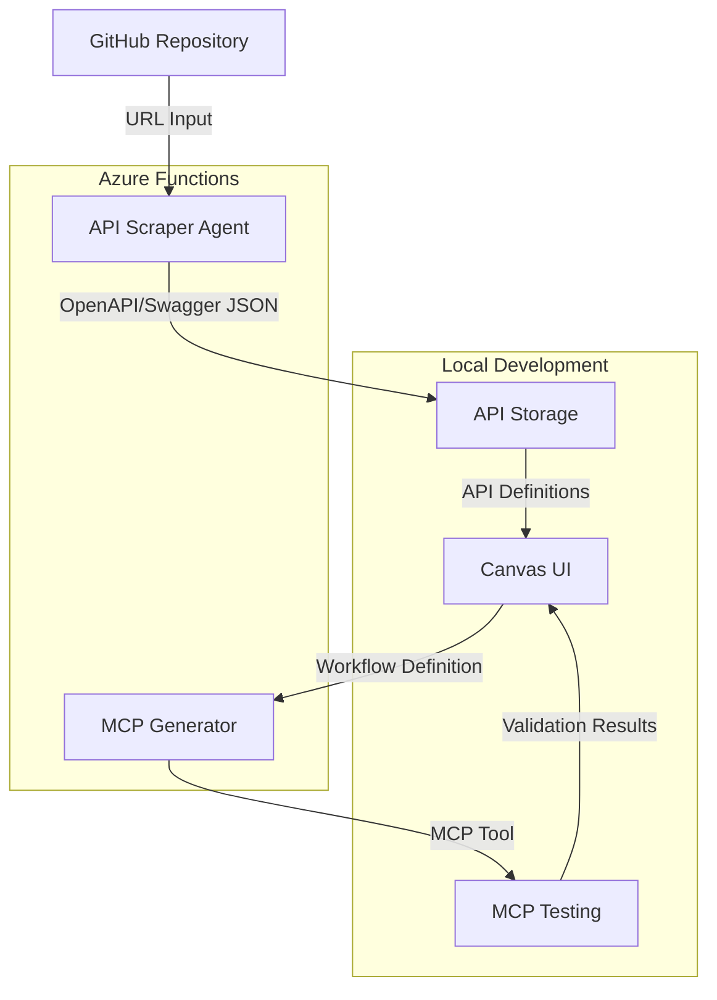

# MCP Workflow Builder - Executive Summary

## Project Overview

The MCP Workflow Builder is a proof-of-concept (POC) application designed to create an enhanced API wrapper system that facilitates secure and intelligent interactions between AI agents and enterprise applications. This tool enables users to extract APIs from GitHub repositories, visually create workflows by connecting these APIs, and export the workflows as MCP (Model Context Protocol) tools that can be used by AI agents.

## Core Components

The POC consists of four main components:

1. **API Scraper Agent**: An Azure Function that extracts REST APIs from GitHub repositories and converts them to OpenAPI/Swagger JSON format.

2. **Canvas UI**: A React-based web application that provides a simple drag-and-drop interface for connecting API endpoints in sequence to create workflows.

3. **MCP Generator**: An Azure Function that converts the visual workflows into executable MCP tools that can be used by AI agents.

4. **MCP Testing Module**: A local Node.js application that tests the generated MCP tools to ensure they function correctly.

## Architecture Highlights

- **Backend**: Azure Functions for API scraping and MCP generation, leveraging Azure OpenAI for intelligent extraction and code generation.
- **Frontend**: React.js application with react-flow for the workflow canvas and Material-UI for the user interface.
- **Storage**: Local JSON storage for API definitions in the POC phase.
- **Testing**: Custom MCP runtime simulator for validating generated tools.

## Key Features

1. **Intelligent API Extraction**:
   - Analyzes GitHub repositories to identify REST APIs
   - Supports repositories with or without explicit OpenAPI/Swagger definitions
   - Uses Azure OpenAI to enhance API descriptions and documentation

2. **Visual Workflow Creation**:
   - Drag-and-drop interface for connecting API endpoints
   - Simple sequential workflow creation
   - Basic configuration options for API connections

3. **MCP Tool Generation**:
   - Converts visual workflows to executable MCP tools
   - Generates appropriate input/output schemas
   - Creates the necessary execution logic to chain API calls

4. **Integrated Testing**:
   - Tests generated MCP tools in a simulated environment
   - Validates correct execution of the workflow
   - Provides feedback on any issues or errors

## Technology Stack

- **Azure Functions**: Node.js 18 runtime for serverless backend components
- **Azure OpenAI**: For intelligent API extraction and code generation
- **React.js**: For the frontend Canvas UI
- **React Flow**: For the workflow canvas visualization
- **Material-UI**: For UI components and styling
- **Node.js**: For the MCP testing module

## Implementation Timeline

The POC is planned to be implemented in 5 phases over an 8-week timeline:

1. **Project Setup and Infrastructure** (Week 1)
2. **API Scraper Implementation** (Weeks 2-3)
3. **Canvas UI Development** (Weeks 3-5)
4. **MCP Generator Implementation** (Weeks 5-6)
5. **MCP Testing and Integration** (Weeks 7-8)

## Business Value

The MCP Workflow Builder POC demonstrates several key business values:

1. **Enhanced AI Integration**: Enables AI agents to securely interact with enterprise applications through a controlled interface.

2. **Simplified Workflow Creation**: Provides a visual, no-code approach to creating API workflows, making it accessible to non-developers.

3. **Accelerated Development**: Reduces the time and effort required to create MCP tools for AI agents.

4. **Improved Security**: Centralizes and controls API access, providing a secure layer between AI agents and enterprise systems.

5. **Future Extensibility**: Lays the groundwork for more advanced features like conditional logic, error handling, and support for additional API types.

## Success Criteria

The POC will be considered successful if it can:

1. Extract REST APIs from at least 3 different types of GitHub repositories
2. Allow users to create simple sequential workflows with the Canvas UI
3. Generate functional MCP tools from the workflows
4. Successfully test the generated MCP tools
5. Demonstrate the end-to-end process from GitHub URL to working MCP tool

## Next Steps

After the POC is completed, potential next steps include:

1. Expanding API support to include GraphQL and other API types
2. Adding advanced workflow features like conditionals, loops, and error handling
3. Implementing authentication and security enhancements
4. Creating workflow templates and sharing capabilities
5. Integrating with additional API sources beyond GitHub
6. Optimizing performance for large repositories
7. Enhancing the UI with more configuration options
8. Supporting custom transformations between API calls

## Conclusion

The MCP Workflow Builder POC represents a significant step toward creating an intelligent API wrapper system that can mediate interactions between AI agents and enterprise applications. By providing a visual interface for creating API workflows and generating MCP tools, it simplifies the process of enabling AI agents to work with existing enterprise systems in a secure and controlled manner.