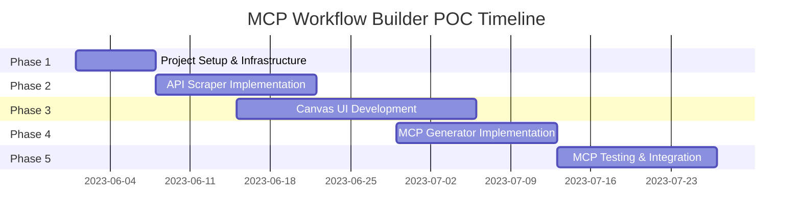

# MCP Workflow Builder - Project Roadmap

This roadmap outlines the implementation timeline, milestones, and development phases for the MCP Workflow Builder POC.

## Overview

The project will be implemented in 5 phases over an estimated 8-week timeline. Each phase builds upon the previous one, with specific milestones and deliverables.

## Phase 1: Project Setup and Infrastructure (Week 1)

**Objective:** Establish the foundational infrastructure and project environment.

### Tasks:
- [ ] Set up Azure Function App
- [ ] Create React application skeleton
- [ ] Configure development environments
- [ ] Set up Azure OpenAI resources
- [ ] Establish project repository and version control
- [ ] Configure CI/CD pipeline (optional)

### Deliverables:
- Functioning development environment
- Azure resources provisioned
- Basic project structure for both frontend and backend
- Documentation of environment setup

### Milestone: Development Environment Ready
**Estimated Completion:** End of Week 1

## Phase 2: API Scraper Implementation (Weeks 2-3)

**Objective:** Develop the API Scraper function that can extract REST APIs from GitHub repositories.

### Tasks:
- [ ] Implement GitHub repository access
- [ ] Develop code analysis for API detection
- [ ] Create OpenAPI/Swagger generation logic
- [ ] Integrate with Azure OpenAI for enhanced API extraction
- [ ] Implement error handling and validation
- [ ] Create unit tests for API Scraper
- [ ] Document API Scraper functionality

### Deliverables:
- Functional API Scraper Azure Function
- Unit tests for API extraction
- Documentation of supported frameworks and limitations
- Sample extracted API definitions

### Milestone: API Extraction Capability
**Estimated Completion:** End of Week 3

## Phase 3: Canvas UI Development (Weeks 3-5)

**Objective:** Create the drag-and-drop canvas interface for building API workflows.

### Tasks:
- [ ] Implement basic UI layout and components
- [ ] Develop API endpoint panel with drag functionality
- [ ] Create workflow canvas with React Flow
- [ ] Implement node and edge creation/deletion
- [ ] Add basic configuration options for API nodes
- [ ] Develop data mapping between API nodes
- [ ] Implement workflow validation
- [ ] Create responsive design
- [ ] Add error handling and user feedback

### Deliverables:
- Functional Canvas UI
- Drag-and-drop workflow creation
- Basic workflow validation
- Responsive design for different screen sizes

### Milestone: Working Canvas Interface
**Estimated Completion:** End of Week 5

## Phase 4: MCP Generator Implementation (Weeks 5-6)

**Objective:** Develop the MCP Generator function that converts workflows to MCP tools.

### Tasks:
- [ ] Implement workflow analysis logic
- [ ] Create code generation templates
- [ ] Develop input/output schema generation
- [ ] Implement execution code generation
- [ ] Integrate with Azure OpenAI for code optimization
- [ ] Add error handling and validation
- [ ] Create unit tests for MCP Generator
- [ ] Document MCP Generator functionality

### Deliverables:
- Functional MCP Generator Azure Function
- Unit tests for MCP generation
- Documentation of MCP tool structure
- Sample generated MCP tools

### Milestone: MCP Generation Capability
**Estimated Completion:** End of Week 6

## Phase 5: MCP Testing and Integration (Weeks 7-8)

**Objective:** Develop the MCP Testing module and integrate all components.

### Tasks:
- [ ] Implement MCP Testing module
- [ ] Create MCP server simulator
- [ ] Develop test execution logic
- [ ] Implement test result visualization
- [ ] Integrate all components
- [ ] Perform end-to-end testing
- [ ] Fix bugs and address issues
- [ ] Optimize performance
- [ ] Complete documentation

### Deliverables:
- Functional MCP Testing module
- Integrated end-to-end workflow
- Comprehensive documentation
- Final POC demonstration

### Milestone: Complete POC
**Estimated Completion:** End of Week 8

## Timeline Visualization

## Resource Allocation

### Development Team:
- 1 Full-stack Developer (100% allocation)
- 1 Azure/Cloud Specialist (50% allocation)
- 1 UI/UX Designer (25% allocation)

### Azure Resources:
- Azure Function App (Consumption Plan)
- Azure OpenAI Service
- Azure Storage Account

## Risk Assessment

### Potential Risks:
1. **API Extraction Complexity**
   - **Risk Level:** High
   - **Mitigation:** Start with well-documented APIs and common frameworks, gradually expand support

2. **Azure OpenAI Integration**
   - **Risk Level:** Medium
   - **Mitigation:** Develop fallback mechanisms for when AI assistance is not available

3. **MCP Tool Generation Accuracy**
   - **Risk Level:** High
   - **Mitigation:** Implement thorough validation and testing, start with simple workflows

4. **Performance Issues**
   - **Risk Level:** Medium
   - **Mitigation:** Implement pagination and chunking for large repositories, optimize code generation

## Success Criteria

The POC will be considered successful if it can:

1. Extract REST APIs from at least 3 different types of GitHub repositories
2. Allow users to create simple sequential workflows with the Canvas UI
3. Generate functional MCP tools from the workflows
4. Successfully test the generated MCP tools
5. Demonstrate the end-to-end process from GitHub URL to working MCP tool

## Future Enhancements (Post-POC)

1. Support for GraphQL APIs
2. Advanced workflow features (conditionals, loops, error handling)
3. Authentication and security enhancements
4. Workflow templates and sharing
5. Integration with additional API sources beyond GitHub
6. Performance optimizations for large repositories
7. Enhanced UI with more configuration options
8. Support for custom transformations between API calls